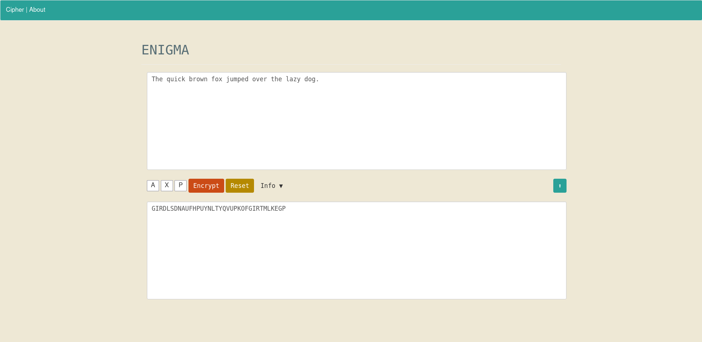

# ENIGMAWEB

A basic implementation of the German WWII Enigma machine.
Uses Python for the backend, and Flask to serve.

A python adaption of [enigma_c](https://github.com/atmaybury/enigma_c), a command line version I wrote in c.

To use, install Flask and Flask-JSGlue in your virtual environment.

## Instructions
* Enter cleartext in the upper dialog box.
* Enter 3 letters to act as the cipher key. This is the equivalent of setting the rotor positions on the physical Enigma machine.
* The cleartext will be stripped of any non-alphabetical characters and switched to uppercase before enciphering.
* Clicking the up-arrow to the right will transfer the ciphertext back into the cleartext dialog box. If it is passed again with the same cipher key the encipherment will be reversed. This mirrors the functionality of the original Enigma machine, in which communications could only be deciphered by passing them through an enigma machine with the same settings used in the original encipherment.
